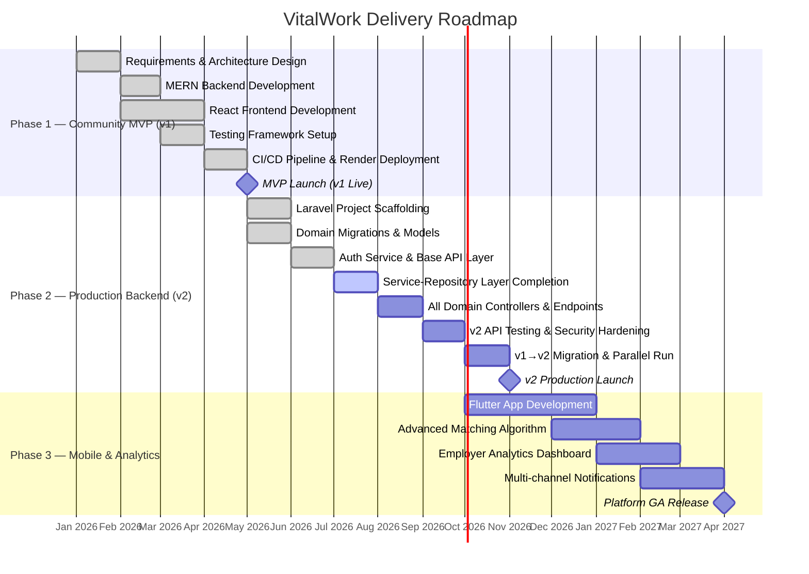

# VitalWork — Project Plan Report
**Classification:** Internal · Project Management Artifact  
**Report Version:** 1.0  
**Prepared By:** Senior Project Manager (IBM Software & Systems Architect Methodology)  
**Report Date:** July 5, 2026  
**Repository:** [github.com/Abdelkouddous/VitalWork](https://github.com/Abdelkouddous/VitalWork)

---

## Table of Contents

1. [Executive Summary](#1-executive-summary)
2. [Project Charter](#2-project-charter)
3. [Stakeholder Register](#3-stakeholder-register)
4. [System Architecture Overview (IBM 4+1 View Model)](#4-system-architecture-overview-ibm-41-view-model)
5. [Work Breakdown Structure (WBS)](#5-work-breakdown-structure-wbs)
6. [Project Roadmap & Milestone Plan](#6-project-roadmap--milestone-plan)
7. [Technology Stack & Tool Inventory](#7-technology-stack--tool-inventory)
8. [Risk Register](#8-risk-register)
9. [Quality & Testing Strategy](#9-quality--testing-strategy)
10. [Security & Compliance Posture (HIPAA / GDPR / NHS DSPT)](#10-security--compliance-posture-hipaa--gdpr--nhs-dspt)
11. [Technical Debt & Architectural Gap Analysis](#11-technical-debt--architectural-gap-analysis)
12. [Delivery Governance](#12-delivery-governance)

---

## 1. Executive Summary

**VitalWork** is a mission-critical, HIPAA/GDPR/NHS DSPT-aligned **Enterprise Healthcare Recruitment Platform** designed exclusively for clinical environments. The system replaces high-noise, generic job boards with a specialized, role-based recruitment engine that facilitates high-fidelity matches between healthcare employers (clinics, hospitals, specialized care facilities) and healthcare professionals (doctors, nurses, therapists, pharmacists, allied health).

The project is structured across **two major system generations**:

| Generation | Stack | Status |
|---|---|---|
| **v1 — Community MVP** | Node.js / Express / MongoDB / React (Vite) | ✅ Deployed (`Render`) |
| **v2 — Production** | Laravel (PHP) / PostgreSQL / React / Flutter Mobile | 🔄 In Active Development |

From an IBM Software & Systems Architect lens, the project demonstrates sound **3-Tier MVC architectural decomposition**, implements **RBAC (Role-Based Access Control)**, enforces **stateless JWT authentication**, and exhibits a deliberate **evolutionary architecture strategy** — migrating from a Node.js community MVP toward a Laravel-backed, production-hardened monolith with a clean **Service-Repository layer pattern** (`app/Services/`, `app/Repositories/`).

> [!IMPORTANT]
> The transition from v1 to v2 represents the **single highest-priority delivery risk**. Both versions are live simultaneously, requiring a parallel-run migration strategy and feature parity validation before v1 is decommissioned.

---

## 2. Project Charter

| Attribute | Detail |
|---|---|
| **Project Name** | VitalWork — Enterprise Healthcare Recruitment Platform |
| **Project Sponsor** | Healthcare Recruitment Manager / Clinic HR Lead |
| **Project Manager** | Abdelkouddous (Technical Lead & Sole Developer) |
| **Start Date** | Q1 2026 (estimated) |
| **Target MVP Launch** | ✅ Completed (v1 deployed on Render) |
| **Target Production Launch** | Q3–Q4 2026 (v2 Laravel + Flutter) |
| **Business Objective** | Provide a HIPAA/GDPR-compliant, specialized digital hiring channel for medical institutions — reducing time-to-fill clinical roles and improving candidate-employer match quality |
| **Success Metrics** | Candidate application-to-interview conversion rate, time-to-fill per role, employer retention, platform compliance audit pass rate |
| **Budget** | Community tier (open-source tooling, free-tier cloud services for MVP) |
| **Delivery Methodology** | Phased Incremental Delivery (3 defined phases) |
| **License** | MIT |

---

## 3. Stakeholder Register

| Stakeholder | Role | Interests | Influence |
|---|---|---|---|
| **Healthcare Professional** | End User (Candidate) | Secure profile, CV upload, job discovery, application tracking | High |
| **Clinic Admin / Hiring Manager** | End User (Employer) | Job posting, candidate review, messaging, hiring decision | High |
| **Platform Admin** | Internal Operator | System integrity, credential verification, user access control | High |
| **Patients (Indirect)** | Beneficiary | Quality of clinical staff recruited through the platform | Low (indirect) |
| **Regulatory Bodies** | Compliance Authority | HIPAA, GDPR, NHS DSPT adherence | Critical |
| **Cloud Providers** | Infrastructure Vendor | Render (deployment), MongoDB Atlas, Cloudinary CDN | Medium |

---

## 4. System Architecture Overview (IBM 4+1 View Model)

IBM's **4+1 Architectural View Model** (Kruchten, 1995) organizes system description across five complementary viewpoints. Applied to VitalWork:

---

### 4.1 Logical View — Domain Decomposition

The domain is partitioned into **8 primary bounded contexts**:

```
┌──────────────────────────────────────────────────────────────────┐
│  VitalWork Domain Model                                          │
│                                                                  │
│  [Identity & Access]   [Candidate]     [Employer / Clinic]      │
│  User, Role, JWT       JobSeeker       ClinicProfile             │
│  RBAC Matrix           CV, Certs       Job Posting               │
│                                                                  │
│  [Matching]            [Communication] [Content]                 │
│  Application           Conversation    Blog / Branding           │
│  Compatibility Score   Message         Comment                   │
│                                                                  │
│  [Notification]        [Platform Ops]                            │
│  Notification          Admin Controls                            │
└──────────────────────────────────────────────────────────────────┘
```

**Entity Relationship Summary (v2 Production Schema):**

| Entity | Primary Key | Notable Relationships |
|---|---|---|
| `User` | `uuid` | Base identity — extended by ClinicProfile, HealthcareProfessionalProfile, Admin |
| `ClinicProfile` | `uuid` | Publishes `Job`, originates `Conversation` |
| `HealthcareProfessionalProfile` | `uuid` | Submits `Application`, uploads `CV`, accepts `Conversation` |
| `Job` | `uuid` | Receives `Application`, contextualizes `Conversation` |
| `Application` | `uuid` | Links `Job` ↔ `HealthcareProfessionalProfile`; unique constraint on `(job_id, hp_id)` |
| `CV` | `uuid` | Document asset linked to professional profile; active reference pointer pattern |
| `Conversation` / `Message` | `uuid` | Employer-candidate real-time messaging channel |
| `Notification` | `uuid` | Event-driven alert per recipient user |
| `Blog` / `Comment` | `uuid` | Talent branding content layer |

> [!NOTE]
> **Compliance note:** All primary and foreign keys use `uuid` in v2 (per the sharding guard rule), resolving a v1 anti-pattern where MongoDB `ObjectId` was used. This ensures future distributed data partitioning without collision risk.

---

### 4.2 Process View — Runtime & Concurrency

**v1 (Node.js):** Single-process, event-driven, non-blocking I/O. Express HTTP server co-hosts REST endpoints and Socket.io WebSocket gateway on the same Node.js process. Concurrency is handled by the JavaScript event loop.

**v2 (Laravel):** PHP-FPM process model with synchronous request handling. Real-time messaging will be offloaded to a queue worker (Laravel Queues + Broadcast) to prevent blocking the HTTP workers.

**Critical concurrency boundary:**  
Socket.io in v1 operates in-process with no socket authentication guard. **This is a known security gap.** v2 must validate WebSocket connections with the same JWT middleware chain before allowing room joins or event broadcasts.

---

### 4.3 Development View — Component & Module Structure

```
VitalWork/
├── apps/
│   ├── api-v1-community/          # MERN Backend (v1 — Active/Deployed)
│   │   ├── controllers/           # Request handlers (thin, business logic coupling ⚠️)
│   │   ├── models/                # Mongoose ODM schemas
│   │   ├── middleware/            # Auth, RBAC, error pipeline
│   │   ├── routes/                # REST endpoint mappings
│   │   └── utils/                 # Token signers, Cloudinary SDK wrappers
│   │
│   ├── api-v2-production/         # Laravel Backend (v2 — In Development)
│   │   └── app/
│   │       ├── Http/Controllers/  # Thin HTTP adapters (BaseApiController pattern ✅)
│   │       ├── Services/          # Business logic layer (AuthService ✅)
│   │       ├── Repositories/      # Data access abstraction layer ✅
│   │       ├── Models/            # Eloquent ORM models (uuid keys ✅)
│   │       ├── Requests/          # Input validation (DTO pattern)
│   │       ├── Resources/         # Output transformation (API response shaping)
│   │       ├── Contracts/         # Interface definitions (DIP ✅)
│   │       └── Enums/             # Type-safe domain enumerations ✅
│   │
│   ├── client/                    # React 18 / Vite SPA (Presentation Layer)
│   │   └── src/
│   │       ├── components/        # Reusable UI elements
│   │       ├── pages/             # Route-level layout entrypoints
│   │       └── utils/             # Axios HTTP wrappers
│   │
│   └── mobile/                    # Flutter Mobile App (Planned / Scaffolded)
│
├── docs/                          # Architecture diagrams & requirements
├── tests/                         # Automated test suite (Jest, Playwright, Artillery)
└── .github/                       # CI/CD pipeline (GitHub Actions)
```

**IBM Architectural Assessment:**  
- ✅ v2 applies **Clean Architecture** layers: Controllers → Services → Repositories → Models  
- ✅ `Contracts/` directory enforces **Dependency Inversion Principle (DIP)**  
- ✅ `Enums/` provides **type-safe domain taxonomy** (prevents magic strings)  
- ⚠️ v1 shows **controller fat** — business logic directly in controllers, bypassing a service layer  
- ⚠️ `mobile/` app is scaffolded but has no implementation yet (single `README.md`)

---

### 4.4 Physical View — Deployment Topology

**Current (MVP — v1):**

```
                ┌─────────────────────────────────────┐
                │       Render Cloud PaaS              │
                │  ┌──────────────────────────────┐   │
                │  │  Node.js Process (Express)   │   │
                │  │  + Socket.io on same port    │   │
                │  │  + React SPA served as static│   │
                │  └──────────────┬───────────────┘   │
                └─────────────────┼───────────────────┘
                                  │
              ┌───────────────────┴────────────────────┐
              │                                        │
   ┌──────────▼──────────┐               ┌────────────▼──────┐
   │  MongoDB Atlas       │               │  Cloudinary CDN   │
   │  (Document Store)    │               │  (CV / File Store)│
   └─────────────────────┘               └───────────────────┘
```

**Target (Production — v2):**

```
   ┌─────────────────────────────────────────────────────┐
   │             CDN / Reverse Proxy (Nginx)              │
   └──────────┬─────────────────────┬────────────────────┘
              │                     │
   ┌──────────▼──────┐   ┌─────────▼──────────┐
   │  Laravel API     │   │  React SPA / Flutter│
   │  (PHP-FPM)       │   │  (Static / Mobile)  │
   │  + Queue Workers │   └────────────────────┘
   └──────┬──────────┘
          │
   ┌──────▼──────┐   ┌──────────────────┐
   │  PostgreSQL  │   │  Cloudinary CDN  │
   │  (v2 target) │   │  (Media Assets)  │
   └─────────────┘   └──────────────────┘
```

> [!WARNING]
> The v1 deployment collocates the API, WebSocket server, and static SPA serving on a single Render instance. This is **not horizontally scalable**. The v2 deployment plan must separate static asset serving (CDN), the API tier, and WebSocket/queue workers into independent scaling units.

---

### 4.5 Scenarios View — Key Use Case Flows

**UC-01: Healthcare Professional Application Submission**

```
Candidate → [Login] → [Browse Jobs] → [Select Role] → [Submit Application]
         → [System: Validate Eligibility] → [System: Update Pipeline Status]
         → [Clinic: Notification Received] → [Clinic: Review & Decision]
         → [Candidate: Status Notification]
```

**UC-02: Clinic Job Posting**

```
Clinic Admin → [Login] → [Create Job Listing] → [Specify Specialization / Shift / License]
             → [System: Publish to Job Board] → [Healthcare Professionals: Discovery]
```

**UC-03: Real-Time Employer-Candidate Messaging**

```
Clinic Admin → [Open Conversation] → [WS: Join Room(conversation_id)]
             → [Send Message] → [Socket.io: Broadcast to HP room]
             → [HP: Receive Live Message] → [DB: Persist Message Record]
```

---

## 5. Work Breakdown Structure (WBS)

```
WBS 1.0  VitalWork Platform Delivery
│
├── WBS 1.1  Discovery & Requirements
│   ├── 1.1.1  Stakeholder Interviews & Business Rules
│   ├── 1.1.2  Healthcare Taxonomy Definition (Specializations, Roles)
│   ├── 1.1.3  Compliance Scoping (HIPAA, GDPR, NHS DSPT)
│   └── 1.1.4  API Contract Design (OpenAPI / Swagger)
│
├── WBS 1.2  Architecture & Design
│   ├── 1.2.1  System Context Diagram (Level 0 DFD)
│   ├── 1.2.2  Detailed Data Flow (Level 1 DFD)
│   ├── 1.2.3  Domain Model & ERD Design
│   ├── 1.2.4  RBAC Matrix Definition
│   ├── 1.2.5  Authentication & Session Flow Design
│   └── 1.2.6  v2 Laravel Architecture Blueprint (Service-Repository)
│
├── WBS 1.3  Backend Development — v1 (MERN)    [✅ COMPLETE]
│   ├── 1.3.1  Express Server Bootstrapping
│   ├── 1.3.2  Mongoose Schema Modeling
│   ├── 1.3.3  Auth Middleware (JWT + RBAC)
│   ├── 1.3.4  Job CRUD Endpoints
│   ├── 1.3.5  Application Workflow Endpoints
│   ├── 1.3.6  CV Upload (Multer + Cloudinary)
│   ├── 1.3.7  Socket.io Messaging Integration
│   └── 1.3.8  Mock Database Seeder
│
├── WBS 1.4  Frontend Development — React SPA    [✅ COMPLETE]
│   ├── 1.4.1  Vite Project Setup & Configuration
│   ├── 1.4.2  React Router Page Architecture
│   ├── 1.4.3  React Query Data Fetching Layer
│   ├── 1.4.4  MUI + Tailwind CSS Design System
│   ├── 1.4.5  Authentication UI Flow (Login / Register)
│   ├── 1.4.6  Job Search & Filter Components
│   ├── 1.4.7  Candidate Profile & CV Management
│   └── 1.4.8  Employer Dashboard & Application Review
│
├── WBS 1.5  Backend Development — v2 (Laravel)  [🔄 IN PROGRESS]
│   ├── 1.5.1  Laravel Project Scaffolding & Docker Sail         [✅]
│   ├── 1.5.2  Domain Schema Migrations (PostgreSQL)             [✅]
│   ├── 1.5.3  Eloquent Model Definitions (uuid PKs)             [✅]
│   ├── 1.5.4  BaseApiController & Response Envelope Pattern     [✅]
│   ├── 1.5.5  AuthService & Authentication Controller           [✅]
│   ├── 1.5.6  Service-Repository Layer (Contracts + Impl)       [🔄]
│   ├── 1.5.7  Job, Application, CV, Messaging Controllers       [⏳ Pending]
│   ├── 1.5.8  Form Request Validation & API Resource Shaping    [⏳ Pending]
│   ├── 1.5.9  Sanctum / Passport Token Authentication           [⏳ Pending]
│   └── 1.5.10 Laravel Broadcasting (WebSocket / Reverb)         [⏳ Pending]
│
├── WBS 1.6  Mobile Application (Flutter)         [⏳ PLANNED]
│   ├── 1.6.1  Flutter Project Setup (BLoC State Management)
│   ├── 1.6.2  Authentication Screens
│   ├── 1.6.3  Job Discovery & Search Screens
│   ├── 1.6.4  Candidate Profile & CV Upload (Mobile)
│   └── 1.6.5  Push Notification Integration
│
├── WBS 1.7  Testing & Quality Assurance
│   ├── 1.7.1  Unit Test Suite (Jest)                            [✅ Framework set up]
│   ├── 1.7.2  Integration Test Suite (Jest + Supertest)         [✅ Framework set up]
│   ├── 1.7.3  End-to-End Tests (Playwright — Chrome/Firefox/Safari) [✅ Framework set up]
│   ├── 1.7.4  Performance / Load Tests (Artillery)              [✅ Framework set up]
│   ├── 1.7.5  Frontend Component Tests (Vitest + Testing Library) [✅ Framework set up]
│   └── 1.7.6  Coverage Reporting & CI Gates                     [✅]
│
├── WBS 1.8  DevOps & CI/CD
│   ├── 1.8.1  GitHub Actions Pipeline (ci-cd.yml)              [✅]
│   ├── 1.8.2  Multi-Stage Pipeline: Lint → Unit → Integration → E2E → Security → Deploy [✅]
│   ├── 1.8.3  Render Deployment Configuration (v1)             [✅]
│   └── 1.8.4  v2 Production Deployment Strategy (Containerized) [⏳]
│
└── WBS 1.9  Compliance & Security Hardening
    ├── 1.9.1  HIPAA Access Control & Audit Logging             [✅ v1 partial]
    ├── 1.9.2  GDPR Right to Erasure (Profile Cascade Delete)   [✅ v1]
    ├── 1.9.3  Signed URL Expiration for CV Documents           [⏳ v2 target]
    ├── 1.9.4  Rate Limiting on Auth Endpoints                  [⏳ v2 target]
    ├── 1.9.5  WebSocket Authentication Hardening               [⏳ v2 target]
    └── 1.9.6  NHS DSPT Credential Verification Enhancement     [⏳ v2 target]
```

---

## 6. Project Roadmap & Milestone Plan



### Milestone Summary

| Milestone | Target Date | Status |
|---|---|---|
| **M1 — v1 Community MVP Live** | May 2026 | ✅ Achieved |
| **M2 — v2 Laravel Production API** | November 2026 | 🔄 In Progress |
| **M3 — Flutter Mobile + Analytics GA** | April 2027 | ⏳ Planned |

---

## 7. Technology Stack & Tool Inventory

### Backend

| Component | v1 (Community) | v2 (Production) |
|---|---|---|
| **Language** | Node.js (ESM) | PHP 8.x |
| **Framework** | Express 4 | Laravel (latest) |
| **ORM / ODM** | Mongoose 8 | Eloquent ORM |
| **Database** | MongoDB Atlas | PostgreSQL (SQLite for dev) |
| **Auth** | JWT (jsonwebtoken) + HTTP-Only Cookie | Laravel Sanctum / Passport |
| **Validation** | express-validator | Laravel Form Requests |
| **File Uploads** | Multer 2 → Cloudinary | Cloudinary SDK |
| **Real-time** | Socket.io 4 | Laravel Broadcasting / Reverb |
| **Logging** | Morgan (HTTP) | Laravel Log (Monolog) |
| **Process Mgmt** | Nodemon (dev) | PHP-FPM + Supervisor (prod) |

### Frontend

| Component | Technology |
|---|---|
| **Framework** | React 18 |
| **Build Tool** | Vite |
| **State (server)** | React Query (TanStack Query) |
| **UI Library** | Material-UI (MUI) + Tailwind CSS |
| **Animations** | Framer Motion |
| **HTTP Client** | Axios |
| **WebSocket Client** | Socket.io-client |
| **Routing** | React Router |

### Mobile (Planned)

| Component | Technology |
|---|---|
| **Framework** | Flutter (Cross-platform) |
| **State Management** | BLoC Pattern |
| **API Layer** | Dio HTTP Client |

### Testing

| Layer | Tool | Scope |
|---|---|---|
| **Unit / Integration** | Jest 29 + Supertest | Backend API routes, controllers, middleware |
| **E2E** | Playwright (Chrome, Firefox, Safari) | Full user journey workflows |
| **Performance** | Artillery | Load testing on API endpoints |
| **Frontend Components** | Vitest + Testing Library | React component rendering |
| **Database (Test)** | MongoDB Memory Server | In-memory isolated test DB |
| **Coverage** | Jest Coverage (LCOV, HTML) | Coverage gates in CI |

### DevOps

| Component | Technology |
|---|---|
| **VCS** | Git / GitHub |
| **CI/CD** | GitHub Actions (multi-stage pipeline) |
| **Deployment (v1)** | Render (PaaS) |
| **Containerization** | Docker Sail (v2 dev environment) |
| **Config Management** | `.env` files + `.env.example` templates |

---

## 8. Risk Register

| ID | Risk | Probability | Impact | Severity | Mitigation Strategy |
|---|---|---|---|---|---|
| **R-01** | v1 → v2 migration data loss | Medium | Critical | 🔴 HIGH | Parallel-run both versions; build data migration scripts; validate parity with E2E tests before cutover |
| **R-02** | MongoDB ObjectId → UUID primary key mismatch on cross-version data | High | High | 🔴 HIGH | Full data transformation layer required; never reference v1 ObjectIds in v2 schemas |
| **R-03** | WebSocket authentication bypass (v1) | Medium | High | 🔴 HIGH | Implement socket middleware with JWT validation before room join events |
| **R-04** | HIPAA/GDPR non-compliance in CV handling (unsigned public URLs) | High | Critical | 🔴 HIGH | Enforce signed, time-limited Cloudinary URLs in v2 production environment |
| **R-05** | Single developer bottleneck (bus factor = 1) | High | High | 🔴 HIGH | Document architecture decisions; maintain up-to-date docs; consider a second contributor |
| **R-06** | Scope creep into non-healthcare domains | Medium | Medium | 🟡 MEDIUM | Enforce healthcare-only taxonomy governance; reject general-purpose job features in backlog |
| **R-07** | Compatibility score algorithm remains a placeholder | High | Medium | 🟡 MEDIUM | Define matching algorithm requirements in Phase 3; flag in UX as "beta" until implemented |
| **R-08** | Flutter mobile app timeline risk | Medium | Medium | 🟡 MEDIUM | Descope to Phase 3; v2 React SPA maintains mobile browser compatibility in interim |
| **R-09** | Over-permissive public API endpoints (`/all-seekers`, `/all-employers`) | High | High | 🔴 HIGH | Audit and gate all bulk-list endpoints with role middleware before v2 production |
| **R-10** | No rate limiting on auth endpoints (brute force vulnerability) | High | High | 🔴 HIGH | Implement `throttle:api` middleware on Laravel auth routes before production launch |
| **R-11** | CORS policy too permissive (`*`) | High | Medium | 🟡 MEDIUM | Configure strict CORS allowlist (clinic domains) in v2 production config |
| **R-12** | Test coverage gap (framework exists, test density unclear) | Medium | Medium | 🟡 MEDIUM | Set CI gate: minimum 80% coverage on controllers and middleware before v2 release |

---

## 9. Quality & Testing Strategy

### Testing Pyramid

```
                   ┌──────┐
                   │  E2E │   Playwright (3 browsers)
                   │ Tests│   Full user journey (registration → apply → review)
                   └──────┘
               ┌──────────────┐
               │  Integration │  Jest + Supertest
               │    Tests     │  API endpoints + DB writes
               └──────────────┘
           ┌──────────────────────┐
           │     Unit Tests       │  Jest (isolated functions)
           │                      │  Controllers, middleware, utilities
           └──────────────────────┘
       ┌───────────────────────────────┐
       │    Frontend Component Tests   │  Vitest + Testing Library
       └───────────────────────────────┘
   ┌───────────────────────────────────────┐
   │       Performance / Load Tests        │  Artillery
   └───────────────────────────────────────┘
```

### CI/CD Quality Gates

| Gate | Threshold | Tool |
|---|---|---|
| Lint | 0 errors | ESLint / PHP CS Fixer |
| Unit Tests | Must pass | Jest / PHPUnit (Pest) |
| Integration Tests | Must pass | Jest + Supertest |
| E2E Tests | Must pass (2 retries on CI) | Playwright |
| Code Coverage | ≥ 80% (target) | Jest Coverage |
| Security Audit | 0 critical vulnerabilities | `npm audit` / Composer audit |
| Performance | P95 < 500ms on core endpoints | Artillery |

### Coverage Areas

- **Authentication middleware** — JWT verification, cookie parsing, role enforcement
- **Application workflow** — Apply, review, shortlist, reject state machine
- **CV upload pipeline** — Multer → Cloudinary → DB record
- **RBAC matrix** — All 4 role combinations × all protected routes

---

## 10. Security & Compliance Posture (HIPAA / GDPR / NHS DSPT)

### HIPAA Compliance Mapping

| HIPAA Safeguard | Implementation | Status |
|---|---|---|
| **Access Control** (§164.312(a)) | JWT + RBAC middleware; role-scoped queries | ✅ Implemented |
| **Transmission Security** (§164.312(e)) | TLS 1.2/1.3 enforced; no HTTP fallback | ✅ Implemented |
| **Data at Rest** (§164.312(a)(2)) | Bcrypt (10 rounds) on passwords; no plaintext secrets | ✅ Implemented |
| **Audit Controls** (§164.312(b)) | Morgan HTTP logging; auth event tracing | ✅ Partial (structured logging needed) |
| **Minimum Necessary Standard** | Schema fields limited to clinical need | ✅ Implemented |

### GDPR Compliance Mapping

| GDPR Principle | Implementation | Status |
|---|---|---|
| **Right to Erasure (Art. 17)** | Profile delete cascades: CV + Applications removed | ✅ Implemented |
| **Data Minimization (Art. 5(1)(c))** | Ingestion schemas collect only clinically necessary fields | ✅ Implemented |
| **Secure Document Lifecycle** | Cloudinary signed URLs (production target) | ⚠️ Partial — unsigned in v1 |
| **Purpose Limitation (Art. 5(1)(b))** | Healthcare-only taxonomy enforced; no general-purpose data | ✅ Implemented |
| **Consent & Transparency** | Registration-time user acknowledgment (v2 target) | ⏳ Pending |

### NHS DSPT Alignment

| DSPT Standard | Implementation | Status |
|---|---|---|
| **Staff Roles & Access** | Zero-trust RBAC; no public bulk listing of medical staff | ⚠️ Partial (public endpoints need audit) |
| **Credential Verification** | Professional profiles capture license IDs, specializations, certifications | ✅ Implemented |
| **Data Sharing Agreements** | Messaging scoped to active job context | ✅ Implemented |
| **Incident Reporting** | Audit logging framework in place | ⚠️ Needs structured log aggregation |

---

## 11. Technical Debt & Architectural Gap Analysis

> [!CAUTION]
> The items below represent **structural risks** that must be resolved before the v2 production launch. Each is categorized by architectural layer.

### Debt Register

| ID | Layer | Issue | Priority | Resolution |
|---|---|---|---|---|
| **TD-01** | v1 Backend | Fat controllers — business logic not extracted to a service layer | High | Resolved by design in v2 (Service-Repository pattern) |
| **TD-02** | v1 Backend | JWT payload inconsistency — employers use `{userId, role}`, candidates use `{jobSeekerId}` | High | Standardize to `{userId, role, profileId?}` in v2 |
| **TD-03** | v1 Backend | Public bulk endpoints (`/all-seekers`, `/all-employers`) have no RBAC guard | Critical | Gate with `authorizePermissions('admin')` before v2 launch |
| **TD-04** | v1 Backend | Socket.io rooms have no authentication validation on join | Critical | Add JWT middleware to socket connection handshake |
| **TD-05** | v1 Backend | CORS configured as `*` (wildcard) | High | Restrict to explicit domain allowlist in v2 |
| **TD-06** | v1 Backend | No rate limiting on `POST /auth/login` or `POST /auth/register` | Critical | Add `express-rate-limit` (v1 patch) / `throttle:api` (v2) |
| **TD-07** | v1 Storage | Cloudinary CV URLs are unsigned public URLs | High | Enforce signed URLs with short expiration in v2 |
| **TD-08** | v2 Backend | Only `AuthService` implemented — core domain services not yet built | High | Complete Job, Application, CV, Messaging service layer |
| **TD-09** | Data | MongoDB `ObjectId` in v1 is not UUID-compatible with v2 PostgreSQL schema | High | Build v1→v2 data migration ETL script with UUID remapping |
| **TD-10** | Application | Compatibility score is hardcoded / placeholder — no actual matching algorithm | Medium | Define matching model (specialization + location + experience) in Phase 3 |
| **TD-11** | Mobile | Flutter mobile app is an empty scaffold | Medium | Defer to Phase 3; block Flutter development on v2 API stability |
| **TD-12** | Testing | Test density on v2 Laravel codebase is unknown (no tests visible yet) | High | Add Pest PHP feature tests for every v2 controller + service |

---

## 12. Delivery Governance

### IBM Architecture Decision Record (ADR) Summary

| ADR | Decision | Rationale |
|---|---|---|
| **ADR-01** | Evolutionary architecture: Node.js MVP → Laravel Production | Enables rapid community validation before committing to production-grade infrastructure |
| **ADR-02** | UUID primary keys across all entities | Enables future horizontal sharding and distributed deployment without key collision |
| **ADR-03** | Service-Repository pattern in v2 | Enforces SRP and DIP; isolates business logic from data access and HTTP concerns |
| **ADR-04** | MongoDB for v1, PostgreSQL for v2 | NoSQL enabled rapid schema iteration during MVP; relational DB enforces referential integrity for production |
| **ADR-05** | Stateless JWT in HTTP-Only cookies | Prevents XSS-based token theft while maintaining stateless server architecture |
| **ADR-06** | Cloudinary for all file/document storage | Offloads CDN complexity; enables signed URL access control for HIPAA compliance |
| **ADR-07** | React SPA (Vite) as primary client | Fast development iteration; React Query provides declarative, cache-aware server state |
| **ADR-08** | Flutter for mobile (Phase 3) | Single codebase targeting iOS + Android; BLoC pattern enforces predictable state management |

### Sprint Cadence & WIP Policy

Per the project's engineering protocol, a strict **WIP limit of 2 active tickets** is enforced at all times. At the current stage (July 2026), the two active work streams are:

1. 🔄 **WBS 1.5.6** — Service-Repository layer completion (Laravel v2)
2. 🔄 **WBS 1.9.x** — Security hardening audit (rate limiting, WebSocket auth, public endpoint gating)

> [!TIP]
> Use the `/goal` command to assign Antigravity a long-running, autonomous implementation task for any of the WBS items above. Use `/grill-me` to align on architecture decisions interactively before committing to a new feature design.

### Definition of Done (DoD)

A feature is considered **Done** when all of the following are satisfied:

- [ ] Business logic encapsulated in a **Service class** (not the controller)
- [ ] Input validated via a **Form Request** (v2) or validation middleware (v1)
- [ ] Output shaped via an **API Resource** transformer
- [ ] **Unit tests** written with ≥ 80% function coverage
- [ ] **Integration test** covering the happy path and at least one failure path
- [ ] **RBAC guard** applied to the route — no endpoint is publicly accessible without explicit intent
- [ ] No secrets, keys, or credentials hardcoded
- [ ] Architectural compliance: SRP, DIP, and the integer-money guard (financial fields use `integer cents`)
- [ ] Reviewed against the HIPAA / GDPR compliance checklist
- [ ] CI pipeline passes all gates (lint, unit, integration, security audit)

---

## Appendix A — IBM Software & Systems Architect Competency Alignment

| IBM SA Competency Domain | VitalWork Evidence |
|---|---|
| **Business Architecture** | Stakeholder register, RBAC matrix, compliance scoping (HIPAA/GDPR/NHS DSPT) |
| **Application Architecture** | 3-Tier MVC, Clean Architecture (v2), Service-Repository pattern, BaseApiController envelope |
| **Data Architecture** | ERD with 11 domain entities, UUID PK strategy, Mongoose → Eloquent migration, relational integrity |
| **Infrastructure Architecture** | Render PaaS (v1), Docker Sail (v2 dev), CDN separation plan, horizontal scaling topology |
| **Security Architecture** | Stateless JWT, HTTP-Only cookies, RBAC, Bcrypt hashing, TLS, CORS, rate limiting roadmap |
| **Integration Architecture** | Cloudinary SDK, Socket.io WebSocket, React Query (client-side cache sync), Axios HTTP wrappers |
| **Testing & Quality Architecture** | 5-layer testing pyramid (Unit → Integration → E2E → Performance → Frontend), CI/CD gates |
| **Evolutionary Architecture** | Node.js → Laravel migration with explicit ADR documentation; phased delivery roadmap |

---

*Report generated by Antigravity (Senior Project Manager mode) · July 5, 2026*  
*Aligned to IBM Software & Systems Architect Methodology · 4+1 View Model · Clean Architecture Principles*
